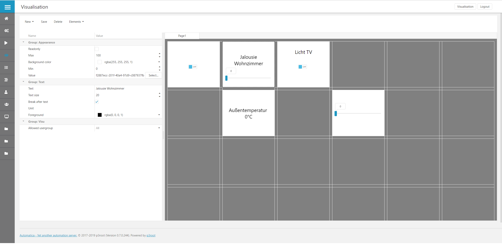

# Automatica.Core

Automatica.Core Server

Automatica.Core Front-End

Automatica is a building management system thats runs on .NET Core and is built to run on every OS. It is able to connect different automation systems and generate a rich visualization with a powerfull rule engine. Try it as your smart home hub today.

# Where to get
I currently use the system on a Raspberry.PI3. It runs also on Windows and Mac, but I have only built a build system for the raspberry right now. If you need Automatica.Core for Windows/Mac just create an Issue.

## Raspberry.PI
You can download the latest image & binaries [here...](https://github.com/automatica-core/automatica/releases)

# Contribute
Comming soon...

# Online Demo
The online demo is available [here...](https://automatica-demo.azurewebsites.net/).
The demo will be reseted daily! So now worry - try everything you want.

~~~
https://automatica-demo.azurewebsites.net

Login
User: sa
Password: sa
~~~

# Docker Images
Docker images will be build daily. The automaticacore image is [here](https://hub.docker.com/r/automaticacore/automaticacore) available. 

There is also a automaticacore_proxy image which represents an nginx reverse proxy.

The automaticacore_demo is just for demonstration purpose - also for the online demo! 

## Run in a docker image
To just play around with automatica.core use this docker-compose configuration.

~~~~
version: '3.3'

services:
   automatica:
    image: automaticacore/automaticacore:develop-latest
    restart: always
    ports:
      - "5001:5001"
      
   nginx:
    image: automaticacore/automaticacore_proxy:develop-latest
    restart: always
    ports:
      - "80:80"
    links:
      - automatica
~~~~

# Roadmap
Things I want to implement in the near future - help is appreciated!

## Core Features   
* Automatica.Core Mobile
* Alarms
* Data Recording
* Automatic editor - to generate time/trigger based actions
* Scripting interface
* Reporting
* Metering    
* ...

## Cloud Features
* Gateway to connect your server via the cloud
* Backup
* Insights (Repoting, ...)
* ...

## Drivers
* KNX Weinzierl BAOS (Raspberry PI)
* ZigBee
* Z-Wave
* Fronius Solar API
* Sonos
* MQTT
* 1-Wire
* Homematic
* HTTP - JSON/XML
* ...

## Logics
* P/PI/PID
* ...

# Screenshots
 Configuration

 Logic editor

 Visualization

# Documentation
[Documentation...](https://docu.automaticacore.com)

... more to come - stay tuned ...

