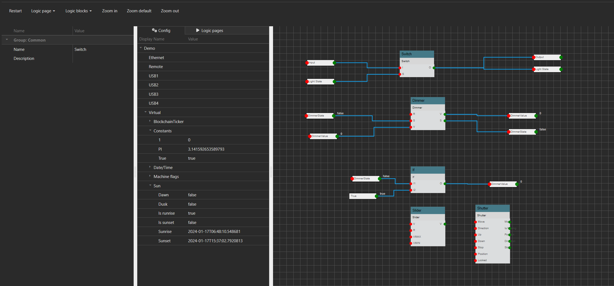

# Automatica.Core
## Status
### Backend Buid ###
[](https://automatica-core.visualstudio.com/automatica/_build/latest?definitionId=12&branchName=develop)

### Frontend Build ###
[](https://automatica-core.visualstudio.com/automatica/_build/latest?definitionId=8&branchName=develop)

Automatica is a building management system thats runs on .NET Core and is built to run on every OS. It is able to connect different automation systems and generate a rich visualization with a powerfull rule engine. Try it as your smart home hub today.

# Table of contents
* [Automatica.Core](#automatica.core)
   * [Build status](#build-status)
      * [Backend](#backend)
      * [Frontend](#frontend)
* [Table of contents](#table-of-contents)
* [Where to get](#where-to-get)
   * [Raspberry.PI](#raspberry-pi)
* [Implemented drivers/logics](#Implemented-drivers/logics)
   * [Drivers](#drivers)   
   * [Logics](#logics)
* [Features](#features)
* [Project structure](#project-structure)
* [How to build](#how-to-build)
   * [Frontend](#frontend)
   * [Backend](#backend)
* [Contribute](#contribute)
* [Online Demo](#online-demo)
* [Docker images](#docker-images)
   * [Run in a docker image](#run-in-a-docker-image)
   * [How to use this image](#how-to-use-this-image)
		* [Database](#database)
			* [SQLite](#sqlite)
			* [MySQL](#mysql)
* [Roadmap](#roadmap)
   * [Roadmap core](#roadmap-core)   
   * [Roadmap cloud](#roadmap-cloud)   
   * [Roadmap drivers](#roadmap-drivers)   
   * [Roadmap logics](#roadmap-logics)   
* [Screenshots](#screenshots)
* [Documentation](#documentation)

# Where to get
I currently use the system on a Raspberry.PI3. It runs also on Windows and Mac, but I have only built a build system for the raspberry right now. If you need Automatica.Core for Windows/Mac just create an Issue.

## Raspberry PI
You can download the latest image & binaries [here](https://github.com/automatica-core/automatica/releases)

# Implemented drivers/logics
At the moment the following drivers & logics are implemented and ready to use, also all the drivers & logics bellow will be shipped by default.

## Drivers
* [Automatica.Remote](./src/automatica.drivers/automatica.driver.automatica.remote)
* [Constants](./src/automatica.drivers/automatica.driver.constants)
* [EnOcean](./src/automatica.drivers/automatica.driver.enocean)
* [FroniusSymo](./src/automatica.drivers/automatica.driver.froniussymo)
* [Apple HomeKit](./src/automatica.drivers/automatica.driver.homekit)
* [Hue Bridge Simulator](./src/automatica.drivers/automatica.driver.huebridgesimulator)
* [Ikea Tradfri](./src/automatica.drivers/automatica.driver.ikeatradfri)
* [KNX+BAOS](./src/automatica.drivers/automatica.driver.knx)
* [Loxone Miniserver](./src/automatica.drivers/automatica.driver.loxone.miniserver)
* [MachineFlags](./src/automatica.drivers/automatica.driver.machineflags)
* [MBus](./src/automatica.drivers/automatica.driver.mbus)
* [ModBus](./src/automatica.drivers/automatica.driver.modbus)
* [OpenWeatherMap](./src/automatica.drivers/automatica.driver.openweathermap.driver)
* [Times](./src/automatica.drivers/automatica.driver.times)
* [WakeOnLan](./src/automatica.drivers/automatica.driver.wakeonlan)
* [ZWave](./src/automatica.drivers/automatica.driver.zwave)
* [Sonos](./src/automatica.drivers/automatica.driver.sonos)

## Logics
* [Compare](./src/automatica.logics/automatica.logic.compare.baseoperations)
* [DigitalToAnalog](./src/automatica.logics/automatica.logic.digitaltoanalog)
* [EnOcean](./src/automatica.logics/automatica.logic.enocean)
* [Logic](./src/automatica.logics/automatica.logic.logic.baseoperations)
* [Math](./src/automatica.logics/automatica.logic.math.basicoperations)
* [Messenger](./src/automatica.logics/automatica.logic.messenger)
* [Surveillance](./src/automatica.logics/automatica.logic.surveillance)
* [Time](./src/automatica.logics/automatica.logic.time)
* [String](./src/automatica.logics/automatica.logic.string.baseoperations)

# Features
Automatica.Core provides a rich set of features, for example:
* Trendings - record datapoints (used later for ML, Reporting,...)
* ETS Import - import your existing ETS5 project 
* Dockerizeable - automatica.core can run in a dockerized environment
* Easy to extend
* ...TBC....

# Project structure
This project is a mono repository. The master & develop branch will be splitted nightly.

The Structure of the project is as follows.

    .
    ├── automatica.build/                          # Some build tools for the project (submodule repo)
    ├── bin/                                       # Bin tools for spliting the repo
    ├── build/                                     # Some build tools for the project 
    ├── docker/                                    # Docker build files
    ├── documentation/                             # docfx documentation source
    ├── images/                                    # Image files displayed in the readme.md
    ├── src/                                       # Source files
    |   ├── automatica.core.plugin.standalone      # Standalone plugins - split repository
    |   ├── automatica.core.slave                  # Automatica slave - split repository
    |   ├── automatica.core                        # The core system for automatica.core  - split repository
    |   ├── automatica.drivers                     # Automatica drivers - split repository
    |   ├── automatica.logics                      # Automatica logics - split repository
    |   ├── automatica.supervisor                  # Automatica supervisor - split repository
    ├── LICENSE
    └── README.md

# How to build
Make sure that you have built the frontend first.

## Frontend
~~~
cd src/automatica.core/Automatica.WebNew
npm install
npm run start

The angular dist folder is in src/automatica.core/Automatica.Core/wwwroot
~~~

## Backend
~~~
cd src/automatica.core
dotnet restore
dotnet build
~~~

or open the src/automatica.core/automatica.core.sln with Visual Studio an hit F5.

You can download the latest plugins with the automatica-cli. More [here](https://github.com/automatica-core/automatica.core.cli) 


# Contribute
Please refer to each project's style and contribution guidelines for submitting patches and additions. In general, we follow the "fork-and-pull" Git workflow.

 1. **Fork** the repo on GitHub
 2. **Clone** the project to your own machine
 3. **Commit** changes to your own branch
 4. **Push** your work back up to your fork
 5. Submit a **Pull request** so that we can review your changes

NOTE: Be sure to merge the latest from "upstream" before making a pull request! Pull request must have no merge conflicts!

Any help is appreciated!

# Online Demo
The current demo can be found [here](https://demo.automaticacore.com/).

Login with 
User: sa
Password: sa

Demo will be reseted daily!

# Docker images
Docker images will be build daily. The automaticacore image is [here](https://hub.docker.com/r/automaticacore/automaticacore) available. 

There is also a automaticacore_proxy image which represents an nginx reverse proxy.


## How to use this image
```console
docker run -it -p 5001:5001 -p 5002:5002 --env server:port=5001 --env server:ssl_port=5002 automaticacore/automatica:latest-develop --name automatica
```

## Database
Automatica works with different database systems. Currently we support MySQL and SQlite.

The first startup can takeup some time, because the database needs to be initialized.

### SQLite
```console
$ docker run -it \
    -p 5001:5001 \
    --mount type=bind,source=~/database,target=/app/database \
    -e DATABASE_TYPE="sqlite" \
    -e "ConnectionStrings:AutomaticaDatabaseSqlite=Data Source=/app/database/automatica.core.db" \
    --name automaticacore \
    automaticacore/automatica:latest-develop
```

### MySQL
You need to provide a maria-db server and enter the credentials in the environment variable in the docker run command:

```console
$ docker run -it \
    -p 5001:5001 \
    -e DATABASE_TYPE="mysql" \
    -e ConnectionStrings:"AutomaticaDatabaseMaria=Server=<server>;User Id=<username>;Password=<password>;Database=<db-name>" \
    --name automaticacore \
    automaticacore/automatica:latest-develop
```

### Plugins
Do persist your plugin directory set the "AUTOMATICA_PLUGIN_DIR" environment variable and mount the folder in your docker repository!

## Run in a docker image
To just play around with automatica.core use this docker-compose configuration.

~~~~
version: '3.3'

services:
   automatica:
    image: automaticacore/automaticacore:develop-latest
    restart: always
    ports:
      - "5001:5001"
      
   nginx:
    image: automaticacore/automaticacore_proxy:develop-latest
    restart: always
    ports:
      - "80:80"
    links:
      - automatica
~~~~

# Roadmap
Things I want to implement in the near future - help is appreciated!

## Roadmap core   
* Automatica.Core Mobile ... done (Android)
* Alarms
* Automatic editor - to generate time/trigger based actions
   * Simulate movement in the building when you are on vacation,etc...
* Scripting interface
* Reporting
* Metering
   * Generate reports about your energy consumption and calculate the costs for your building/level/room,....
* AI - Machine Learning
  * The building should know when are people at home and maybe in which room, therefore the building can detect automatically some enhancements for the configuration and be so more energy efficient.     
* ...

## Roadmap cloud
* Gateway to connect your server via the cloud...done
* Backup...done
* Insights (Reporting, ...)...done
* ...

## Roadmap Drivers
* ZigBee
* Z-Wave
* Fronius Solar API
* MQTT
* 1-Wire
* Homematic
* HTTP - JSON/XML
* ...

## Roadmap Logics
* P/PI/PID
* ...

# Screenshots

 Visualization

 Configuration

 Logic editor


# Documentation
[Documentation](https://docu.automaticacore.com)

