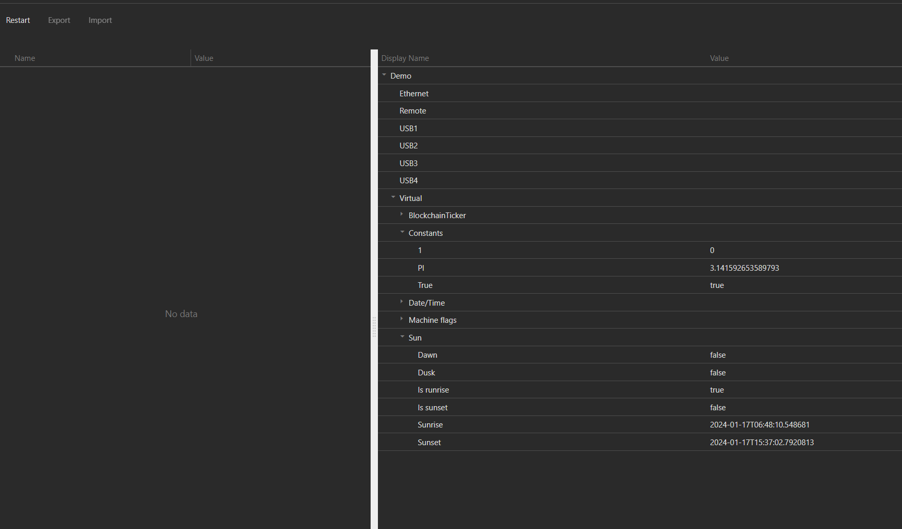

# Automatica.Core

Automatica.Core Server

Automatica.Core Front-End

Automatica is a building management system thats runs on .NET Core and is built to run on every OS. It is able to connect different automation systems and generate a rich visualization with a powerfull rule engine. Try it as your smart home hub today.

# Where to get
I currently use the system on a Raspberry.PI3. It runs also on Windows and Mac, but I have only built a build system for the raspberry right now. If you need Automatica.Core for Windows/Mac just create an Issue.

## Raspberry.PI
You can download the latest image & binaries [here...](https://github.com/automatica-core/automatica/releases)

# Implemented drivers/logics
At the moment the following drivers & logics are implemented and ready to use, also all the drivers & logics bellow will be shipped by default.

## Drivers
* [Automatica.Remote](./automatica.driver.automatica.remote)
* [Constants](./automatica.driver.constants)
* [EnOcean](./automatica.driver.enocean)
* [FroniusSymo](./automatica.driver.froniussymo)
* [Apple HomeKit](./automatica.driver.homekit)
* [Hue Bridge Simulator](./automatica.driver.huebridgesimulator)
* [Ikea Tradfri](./automatica.driver.ikeatradfri)
* [KNX](./automatica.driver.knx)
* [Loxone Miniserver](./automatica.driver.loxone.miniserver)
* [MachineFlags](./automatica.driver.machineflags)
* [MBus](./automatica.driver.mbus)
* [ModBus](./automatica.driver.modbus)
* [OpenWeatherMap](./automatica.driver.openweathermap.driver)
* [Times](./automatica.driver.times)
* [WakeOnLan](./automatica.driver.wakeonlan)
* [ZWave](./automatica.driver.zwave)

## Logics
* [Compare](./automatica.logic.compare.baseoperations)
* [DigitalToAnalog](./automatica.logic.digitaltoanalog)
* [EnOcean](./automatica.logic.enocean)
* [Logic](./automatica.logic.logic.baseoperations)
* [Math](./automatica.logic.math.basicoperations)
* [Messenger](./automatica.logic.messenger)
* [Surveillance](./automatica.logic.surveillance)
* [Time](./automatica.logic.time)

# Project structure
This project is a mono repository. The master & develop branch will be splitted nightly.

The Structure of the project is as follows.

    .
    ├── bin/                     # Bin tools for splitting the repo
    ├── build/                   # Some build tools for the project (alternatively `doc`)
    ├── docker/                  # Docker build files
    ├── images/                  # Image files displayed in the readme.md
    ├── src/                     # Source files
    |   ├── automatica.core      # The core system for automatica.core
    |   ├── automatica.drivers   # Automatica drivers - split repository
    |   ├── automatica.logics    # Automatica logics - split repository
    ├── LICENSE
    └── README.md

# How to build
Make sure that you have built the frontend first.

## Frontend
~~~
cd src/automatica.core/Automatica.WebNew
npm install
npm run start

The angular dist folder is in src/automatica.core/Automatica.Core/wwwroot
~~~

## Backend
~~~
cd src/automatica.core
dotnet restore
dotnet build
~~~

or open the src/automatica.core/automatica.core.sln with Visual Studio an hit F5.

You can download the latest plugins with the automatica-cli. More [here...](https://github.com/automatica-core/automatica.core.cli) 

# Contribute
Please refer to each project's style and contribution guidelines for submitting patches and additions. In general, we follow the "fork-and-pull" Git workflow.

 1. **Fork** the repo on GitHub
 2. **Clone** the project to your own machine
 3. **Commit** changes to your own branch
 4. **Push** your work back up to your fork
 5. Submit a **Pull request** so that we can review your changes

NOTE: Be sure to merge the latest from "upstream" before making a pull request! Pull request must have no merge conflicts!

# Online Demo
The online demo is available [here...](https://demo.automaticacore.com/).
The demo will be reseted daily! So now worry - try everything you want.

~~~
https://demo.automaticacore.com/

Login
User: sa
Password: sa
~~~

# Docker Images
Docker images will be build daily. The automaticacore image is [here](https://hub.docker.com/r/automaticacore/automaticacore) available. 

There is also a automaticacore_proxy image which represents an nginx reverse proxy.

The automaticacore_demo is just for demonstration purpose - also for the online demo! 

## Run in a docker image
To just play around with automatica.core use this docker-compose configuration.

~~~~
version: '3.3'

services:
   automatica:
    image: automaticacore/automaticacore:develop-latest
    restart: always
    ports:
      - "5001:5001"
      
   nginx:
    image: automaticacore/automaticacore_proxy:develop-latest
    restart: always
    ports:
      - "80:80"
    links:
      - automatica
~~~~

# Roadmap
Things I want to implement in the near future - help is appreciated!

## Core Features   
* Automatica.Core Mobile
* Alarms
* Data Recording
  * Record data for reporting, AI,....
* Automatic editor - to generate time/trigger based actions
   * Simulate movement in the building when you are on vacation,etc...
* Scripting interface
* Reporting
* Metering
   * Generate reports about your energy consumption and calculate the costs for your building/level/room,....
* AI - Machine Learning
  * The building should know when are people at home and maybe in which room, therefore the building can detect automatically some enhancements for the configuration and be so more energy efficient.     
* ...

## Cloud Features
* Gateway to connect your server via the cloud
* Backup
* Insights (Repoting, ...)
* ...

## Drivers
* KNX Weinzierl BAOS (Raspberry PI)
* ZigBee
* Z-Wave
* Fronius Solar API
* Sonos
* MQTT
* 1-Wire
* Homematic
* HTTP - JSON/XML
* ...

## Logics
* P/PI/PID
* ...

# Screenshots
 Configuration

 Logic editor

 Visualization

# Documentation
[Documentation...](https://docu.automaticacore.com)

... more to come - stay tuned ...

