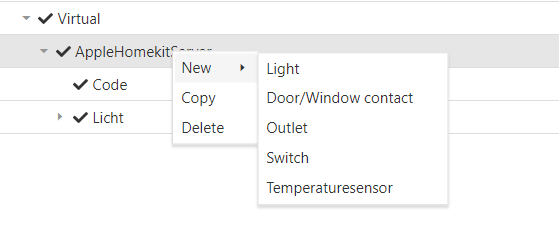
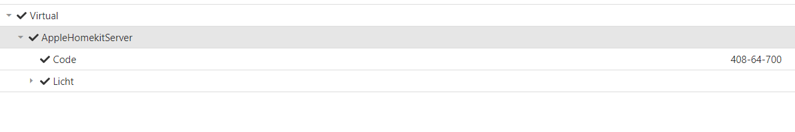

# Introduction 

HomeKit Server is used to connect an HomeKit enabled devices (iPhone, iPad, Apple TV,..) to your Automatica.Core server.

Several services are supported right now:

* Light
* Door/Window contact
* Outlet
* Switch
* Temperaturesensor

# How to use
HomeKit can be added in the Virtual node.

 

 After adding the Apple HomeKit node you can add the implemented Apple HomeKit Services.

 

After adding your services and saving/reloading the config in your automatica.core server - the server will generate a code. This is used to connect your Apple HomeKit enabled device with your automatica.core server.

# Roadmap
* Add more services
   * Fan + Fan v2
   * Garage door opener
   * Thermostat
   * Carbon monoxide sensor
   * Humidity sensor
   * Leak sensor
   * Light sensor
   * Motion sensor
   * Occupancy sensor
   * Smoke sensor
   * Carbon dioxide sensor
   * Speaker
   * Doorbell
   * Slat
