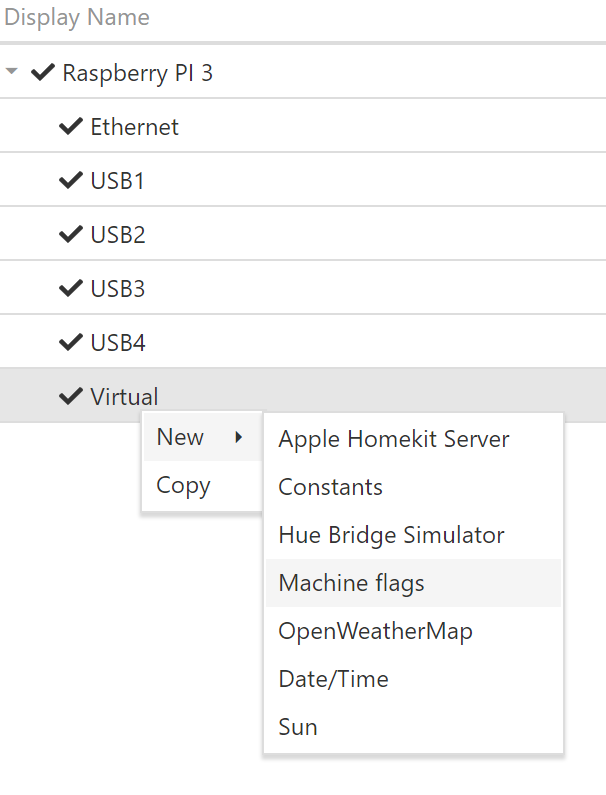
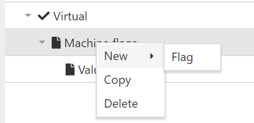
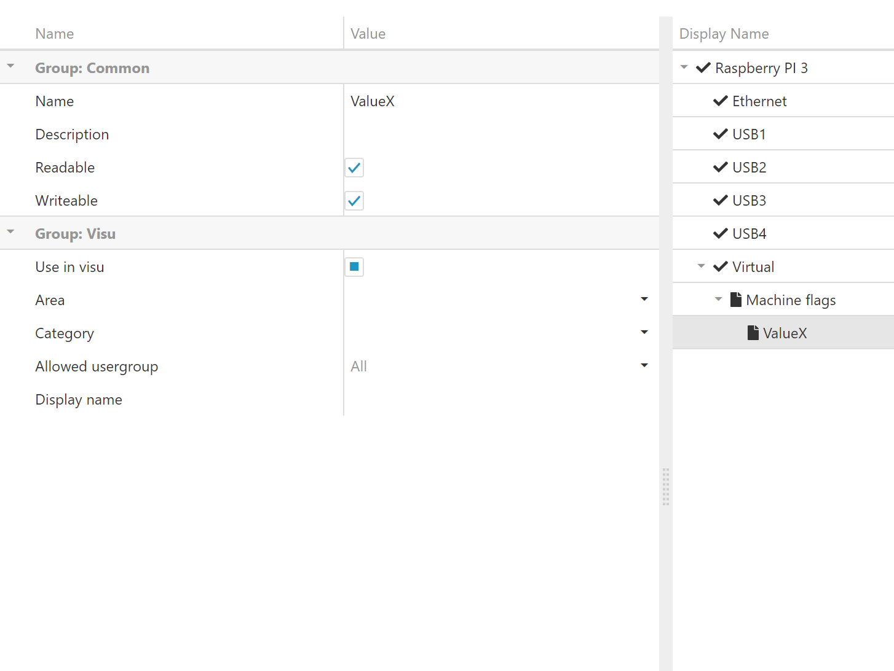

# Introduction 

MachineFlags driver used to store values in a variable and which you can use across the system.

If you want to save a value in a "variable" you can use the MachineFlags driver.

 # How to use
 MachineFlags can be added in the Virtual node.

 

 After adding the MachineFlags node you can add your flag nodes.

 

 After adding a Flag node you can set some values in the property grid on the left.

 

Save & reload your configuration and use your defined flag. 