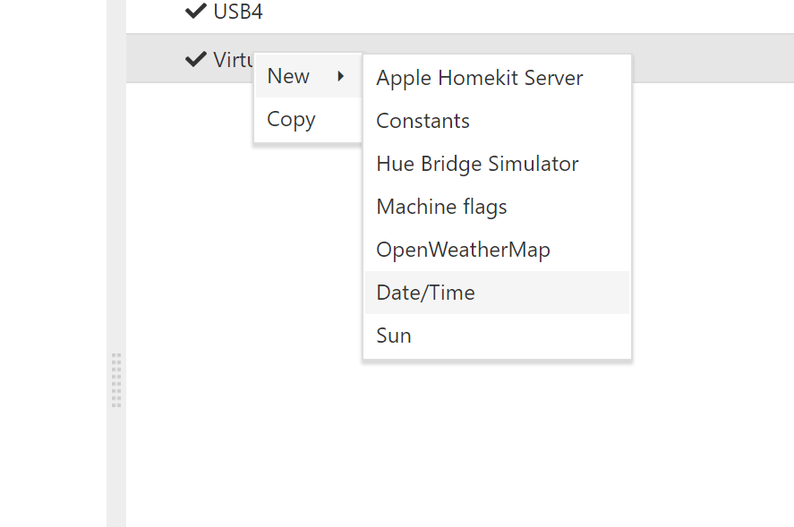
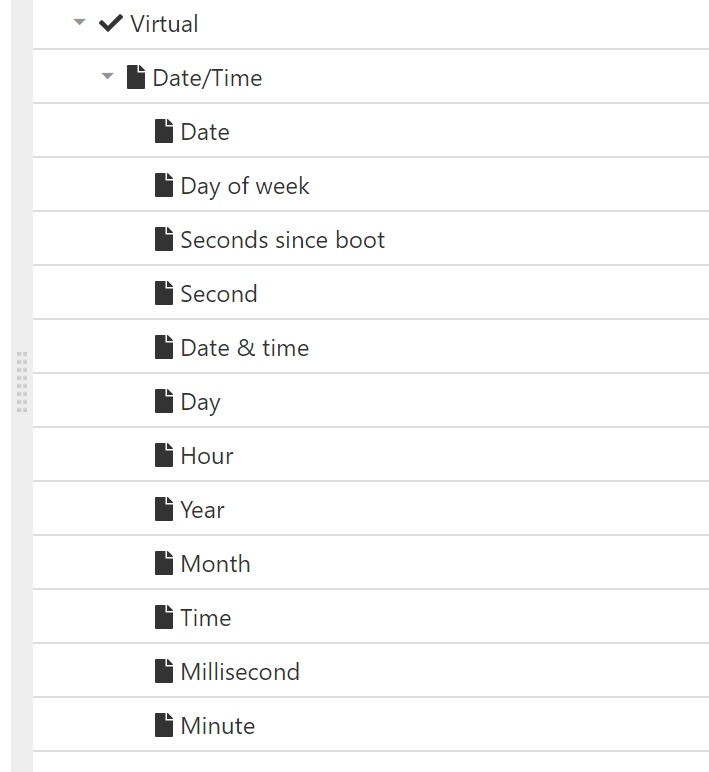
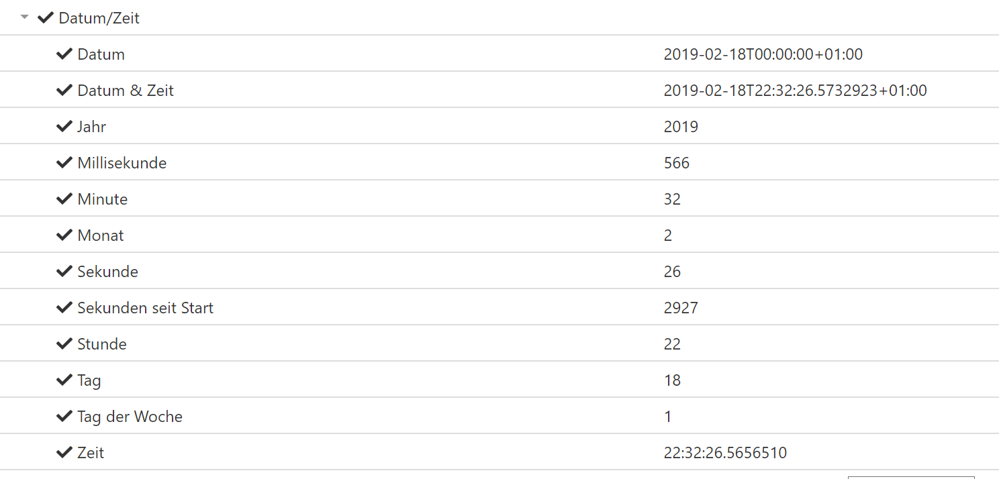
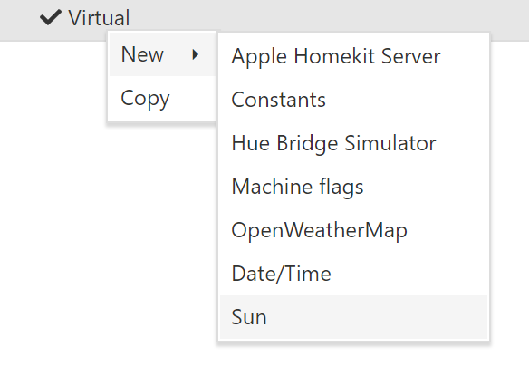
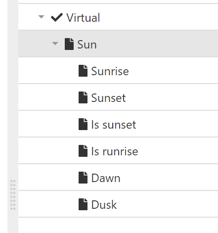

# Introduction 

Times provides date/time and sun angles nodes. 

# Date/Time
Date/Time provides date and time in different formats.

 ## Nodes
 * Date
 * Day of week
 * Seconds since boot
 * Second
 * Date & time
 * Day
 * Hour
 * Year
 * Month
 * Time
 * Milisecond
 * Minute

## How to use
Times can be added in the Virtual node.

After adding the Date/Time node, you can see all the nodes which the driver provides for you. 
Date/Time values are provides in local-time. The used timezone should be configured in your system.

# Sun
Sun provides calculated data of the sun angle, sunrise & sunset.

## Nodes
* Sunrise
    * Time for sunrise
* Sunset
    * Time for sunset
* Is sunset
    * Is sunset
* Is sunrise
    * Is sunrise
* Dawn
    * Is dawn (30 minutes before sunrise)
* Dusk
    * Is dusk  (30 minutes before sunset)

## How to use

  

Save & reload your configuration and use date/time in your Automatica.Core Server.  